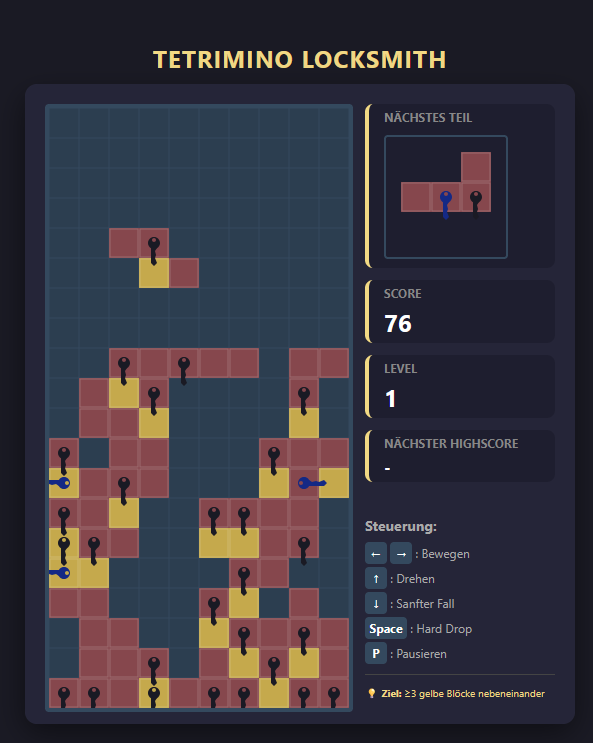

# Tetrimino Locksmith

[Play Tetrimino Locksmith directly in your browser](https://vladtepesch.github.io/TetriminoLocksmith/)

Tetrimino Locksmith is a falling-block puzzle game inspired by all-time-classic Tetris. But here completed lines do nothing.

Instead of completing lines to get them removed you have to use the keys to unlock three horizontal neighboring pieces to remove them.

So arrange the pieces, use their keys to create yellow blocks, and clear horizontal groups of three or more yellow blocks. Build combos, earn points, and climb the high-score table.

## Controls

- Left / Right arrows: Move
- Up arrow: Rotate
- Down arrow: Soft drop
- Space: Hard drop
- P: Pause

## References
Based on Anton Wimmers Game Lockpicking ([Andoid Store](https://play.google.com/store/apps/details?id=de.antonwimmer), [Apple Store](https://apps.apple.com/us/app/lockpicking/id6793054294))
 he showed in a [thread in µController.net](https://www.mikrocontroller.net/topic/587077) Forum.